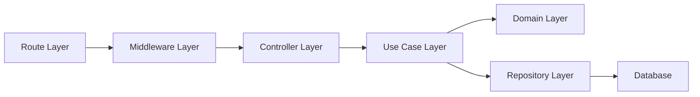
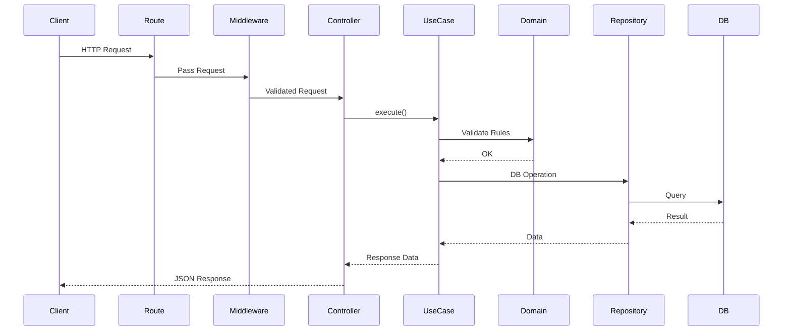
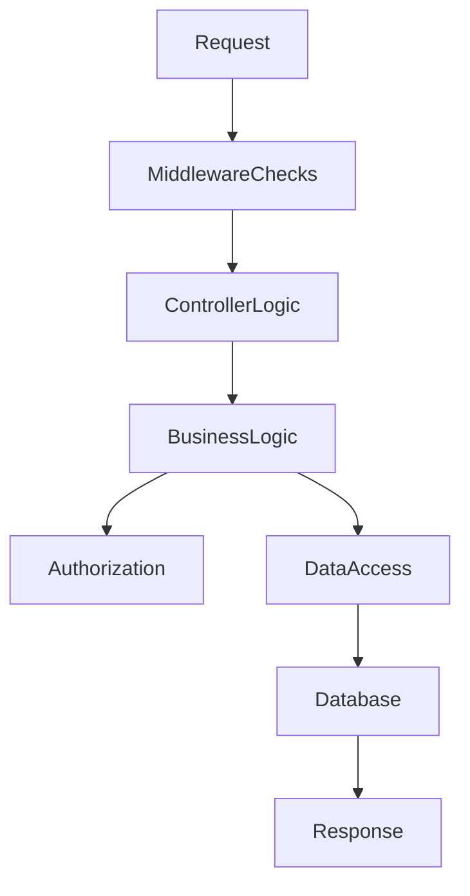

# Backend Architecture

## 1. Overview

This document provides a detailed view of the backend architecture, including system design, layering, and request flow using diagrams.

---

## 2. High-Level Architecture

### Visual Architecture Diagram

```mermaid
graph TD
    subgraph Client Layer
        A[Browser / Frontend]
    end

    subgraph API Layer (Next.js)
        B[API Route]
        C[Middleware Stack\n(CSRF, Rate Limit, Sanitization, CORS)]
        D[Controller]
    end

    subgraph Application Layer
        E[Use Case]
    end

    subgraph Domain Layer
        F[Domain Policies\n(Authorization, Rules)]
    end

    subgraph Infrastructure Layer
        G[Repository]
        H[(MongoDB)]
    end

    A -->|HTTP Request| B
    B --> C
    C --> D
    D --> E
    E --> F
    E --> G
    G --> H
    H --> G
    G --> E
    E --> D
    D --> A
```

---

## 3. Layered Architecture



---

## 4. Detailed Request Flow



---

## 5. Component Responsibilities

### Route Layer
- Entry point for HTTP requests
- Applies middleware stack

### Middleware Layer
- CSRF Protection
- Rate Limiting
- Input Sanitization
- CORS

### Controller Layer
- Parses request
- Calls use case
- Returns response

### Use Case Layer
- Business logic orchestration
- Validation coordination

### Domain Layer
- Authorization rules
- Business policies

### Repository Layer
- Database abstraction
- Query execution

### Database Layer
- MongoDB
- Data persistence

---

## 6. Data Flow Summary



---

## 7. Key Architectural Decisions

- Clean separation of concerns
- No direct DB access from controllers
- Centralized security enforcement
- Modular feature-based structure

---

## 8. Scalability Considerations

- Stateless API design
- Easy horizontal scaling
- Replaceable database layer
- Modular services for future microservices migration

---

## 9. Future Enhancements

- Add caching layer (Redis)
- Introduce message queues (Kafka/RabbitMQ)
- API Gateway integration
- Observability (Tracing + Metrics)

---

## 10. Conclusion

The backend architecture ensures a secure, scalable, and maintainable system by enforcing strict layering, clear responsibilities, and controlled database access.

