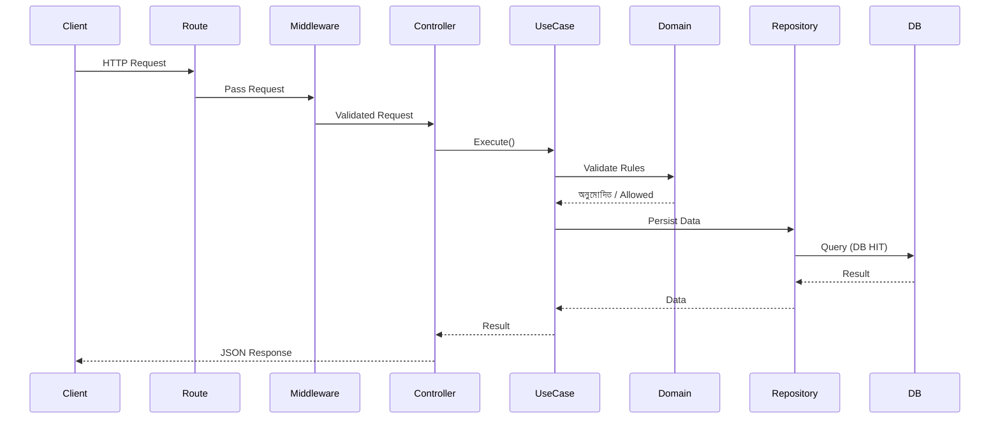

# Backend Security & Request Flow Report (Detailed)

## 1. Executive Summary
This document provides a comprehensive analysis of the backend architecture, security controls, and the complete request lifecycle—from HTTP entry point to database interaction. It emphasizes how each layer enforces validation, authorization, and data integrity before a database write/read occurs.

---

## 2. Architectural Overview

The system follows a **layered (Clean/Hexagonal-inspired) architecture** to enforce separation of concerns and minimize attack surface.

```
Route → Middleware → Controller → Use Case → Domain → Repository → Database
```

### Design Principles
- **Single Responsibility per layer**
- **Dependency inversion (outer layers depend on inner abstractions)**
- **No direct DB access from controllers/routes**
- **Security enforced as early as possible**

---

## 3. Security Controls (Deep Dive)

### 3.1 Input Sanitization
- Centralized sanitizer applied at middleware or controller boundary.
- Removes/escapes:
  - MongoDB operators (`$`, `.`)
  - Script tags and HTML injection vectors
- Prevents:
  - NoSQL Injection
  - Stored/Reflected XSS

### 3.2 DTO Validation (Schema Enforcement)
- DTOs define strict input contracts.
- Validation includes:
  - Required fields
  - Type checks
  - Length constraints
  - Enum validation

**Fail-fast principle:** invalid requests are rejected before business logic.

### 3.3 CSRF Protection
- Token-based validation for all state-changing requests.
- Token verified against secure cookie or header.

**Threat mitigated:** Cross-Site Request Forgery (unauthorized actions from trusted sessions)

### 3.4 Rate Limiting
- Applied per IP/user/session.
- Configurable thresholds (e.g., 100 req/min).

**Threat mitigated:**
- Brute force
- Credential stuffing
- API abuse

### 3.5 Authentication
- Cookie-based session or token-based auth.
- Secure flags:
  - HttpOnly
  - Secure
  - SameSite

### 3.6 Authorization (Domain Policies)
- Enforced in **Domain layer**, not controller.
- Example:
  - User can only modify own profile
  - Role-based checks

### 3.7 Error Handling Strategy
- Structured error classes:
  - `ValidationError`
  - `NotFoundError`
  - `UnauthorizedError`
- No stack traces or DB internals exposed to client.

### 3.8 Audit Logging
- Logs critical events:
  - Login attempts
  - Data updates
  - Authorization failures

---

## 4. Detailed Request Lifecycle

### Example Endpoint
```
PUT /api/v1/profile/coreCompetencySection
```

---

### 4.1 Route Layer

**Responsibilities:**
- Entry point
- Compose middleware
- Forward request to controller

**Example (conceptual):**
```js
export const PUT = withRateLimit(withCsrf(controller.update));
```

---

### 4.2 Middleware Layer

Executed sequentially:

#### (1) CORS Middleware
- Validates origin
- Sets response headers

#### (2) Rate Limiter
- Rejects excessive requests

#### (3) CSRF Middleware
- Validates CSRF token

#### (4) Sanitization Middleware
- Cleans request body/query

**Failure Behavior:**
- Immediate response
- No further execution

---

### 4.3 Controller Layer

**Responsibilities:**
- Extract request data
- Call use case
- Handle response formatting

**Example Flow:**
```js
const result = await updateCoreCompetencyUseCase.execute(payload);
return Response.json({ success: true, data: result });
```

**Important:**
- No business logic
- No DB access

---

### 4.4 Use Case Layer (Application Layer)

**Responsibilities:**
- Orchestrate business logic
- Coordinate domain + repository

**Typical Steps:**
1. Validate DTO
2. Fetch required entities
3. Apply business rules
4. Call repository

**Example:**
```js
const profile = await repo.findById(profileId);
if (!profile) throw new NotFoundError();

ProfilePolicy.canEdit(user, profile);

return repo.updateCoreCompetency(profileId, data);
```

---

### 4.5 Domain Layer

**Responsibilities:**
- Core business rules
- Policies and invariants

**Example Policy:**
```js
class ProfilePolicy {
  static canEdit(user, profile) {
    if (user.id !== profile.userId) {
      throw new UnauthorizedError();
    }
  }
}
```

**Key Insight:**
- Security logic lives here (not controller)

---

### 4.6 Repository Layer

**Responsibilities:**
- Abstract DB operations
- Provide clean API to use case

**Example:**
```js
async updateCoreCompetency(profileId, data) {
  return ProfileModel.updateOne(
    { _id: profileId },
    { $set: { coreCompetency: data } }
  );
}
```

---

### 4.7 Database Layer (MongoDB)

**Actual DB Hit Happens Here**

Operations:
- `findOne()`
- `updateOne()`
- `insertOne()`

**Flow:**
```
MongoDB
   ↑
Repository
   ↑
Use Case
   ↑
Controller
```

---

## 5. End-to-End Execution Flow (Step-by-Step)

```
1. Client sends HTTP request
2. Route receives request
3. Middleware stack executes:
   - CORS
   - Rate Limit
   - CSRF
   - Sanitization
4. Controller parses request
5. Use Case executes business logic
6. Domain validates permissions
7. Repository performs DB operation
8. MongoDB executes query (DB HIT)
9. Response propagates back up
10. Client receives response
```

---

## 6. Sequence Diagram (Mermaid)



---

## 7. Where Exactly DB is Hit (Critical Insight)

The **database is ONLY accessed in the Repository layer**.

### Why this matters:
- Prevents direct DB exposure
- Centralizes query logic
- Enables easier testing & mocking
- Improves security auditing

**Incorrect (anti-pattern):**
```
Controller → DB ❌
```

**Correct:**
```
Controller → UseCase → Repository → DB ✅
```

---

## 8. Security Enforcement Points

| Layer        | Security Responsibility |
|-------------|------------------------|
| Middleware  | CSRF, Rate Limit, Sanitization |
| Controller  | Input handling only |
| Use Case    | Business validation |
| Domain      | Authorization |
| Repository  | Safe DB interaction |

---

## 9. Potential Vulnerabilities (If Misconfigured)

### 9.1 Skipping Sanitization
→ NoSQL Injection risk

### 9.2 Weak Authorization
→ Horizontal privilege escalation

### 9.3 Missing CSRF
→ Unauthorized state changes

### 9.4 Direct DB Access
→ Tight coupling + security risk

### 9.5 Improper Error Handling
→ Information leakage

---

## 10. Recommended Enhancements

- Add **schema-level validation (Mongoose validators)**
- Implement **request tracing (correlation IDs)**
- Add **WAF layer (Cloudflare / API Gateway)**
- Enable **query logging for anomaly detection**
- Use **Zod or Joi for stronger DTO validation**

---

## 11. Conclusion

The backend is architected with strong separation of concerns and layered security. A database hit only occurs after passing multiple validation and authorization checkpoints, ensuring:

- Data integrity
- Controlled access
- Reduced attack surface

This design aligns with modern backend best practices and is highly maintainable, scalable, and secure when properly enforced.

---

## 12. Appendix: Minimal Flow Mapping to Code

```
/api/v1/profile/coreCompetencySection (Route)
  ↓
Middleware (CSRF, RateLimit, Sanitizer)
  ↓
auth.controller.js (Controller)
  ↓
updateCoreCompetency.usecase.js (Use Case)
  ↓
profile.policy.js (Domain)
  ↓
profile.repository.js (Repository)
  ↓
MongoDB (DB HIT)
```

